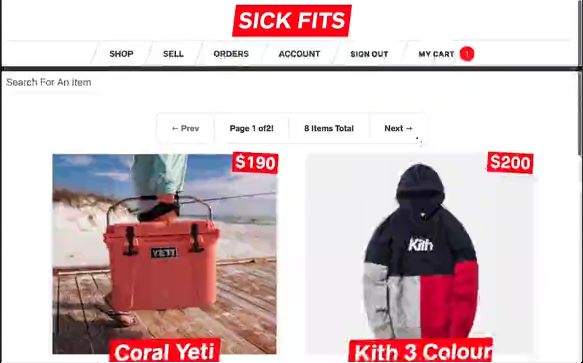

# Project I build to practice React & GraphQL

I build this website as part of the Wes Bos course, focused on fullstack advanced React and GraphQL. Other technologies include Hooks, Apollo, and Keystone Headless CMS.

Sick Fits is an online clothing store with Stripe capabilities to do mock purchases, complete with sending confirmation emails. It also contains authentication and permissions, maintained by Keystone.JS and Prisma DB.

